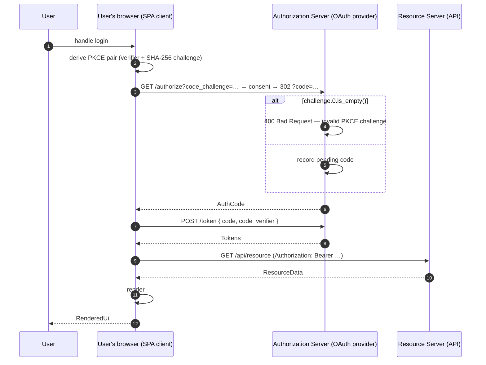
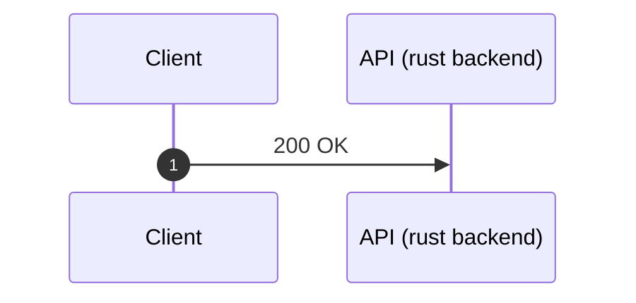

# ⇶ rust2seq

Easily derive [sequence diagrams](https://en.wikipedia.org/wiki/Sequence_diagram) from Rust code that never become stale.

Simply annotate your participants and messages, and `rust2seq` reads your code and generates a [PlantUML](https://plantuml.com/) diagram that you can [easily render](https://marketplace.visualstudio.com/items?itemName=jebbs.plantuml) inside of your IDE.

## 🖼️ Example Diagram

The following diagram is generated from [rust2seq-example/src/lib.rs](rust2seq-example/src/lib.rs):



## 📦 Install

```sh
cargo install --locked --git https://github.com/macromoo/rust2seq rust2seq-driver
```

Then, for each project that should generate sequence diagrams, add this to your `Cargo.toml`:

```toml
[dependencies]
rust2seq = { git = "https://github.com/macromoo/rust2seq" }
```

This pulls in the proc-macros (`#[seq::participant]`, `#[seq::msg]`, `seq::diagram!`, …) you'll need to annotate your types and methods.

> [!NOTE]
> This is not a macro — it's a Rust compiler plugin. There's no other way to easily get the amount of semantic information required to do this as a macro.
>
> The first install might take a few minutes to compile, but subsequent updates should be fast.

## 🚀 Usage

Simply run the following to generate your diagrams:

```sh
cargo rust2seq
```

The above validates the workspace, finds every `seq::diagram! { ... }` invocation, and writes `diagrams/<name>.puml` (relative to the crate root) for each declared sequence diagram in your code. Open any of them in your PlantUML viewer of choice to render.

To detect diagram drifts (e.g., for CI/CD purposes), just run `git diff --exit-code -- diagrams/`.

## 🧩 API surface

rust2seq makes use of a few simple macros that help you annotate your code.

|                                                  | what it does                                                               |
|--------------------------------------------------|----------------------------------------------------------------------------|
| `seq::diagram! { name, entry, title?, output? }` | declares one diagram; `entry` is the fn to walk from                       |
| `#[seq::participant]`                            | marks a struct/enum as a diagram lane (required on every participant type) |
| `#[seq::participant(display = "Multi\nLine")]`   | sets the lane's display label (defaults to type name)                      |
| `#[seq::msg]`                                    | marks a fn as a step; `from`/`to`/label all inferred                       |
| `#[seq::label("custom")]`                        | overrides the auto-derived label for the preceding `#[seq::msg]` fn        |

That's all there is to it! ❤️

## ✨ Minimal Example

Here's a minimal hello-world that uses each annotation exactly once:

```rust
use rust2seq as seq;

seq::diagram! {
    name = "hello",
    title = "Hello, World!",
    entry = Client::greet,
}

#[seq::participant]
pub struct Client;

#[seq::participant(display = "API\n(rust backend)")]
pub struct Server;

impl Client {
    #[seq::msg]
    pub fn greet() {
        Server::respond();
    }
}

impl Server {
    #[seq::msg]
    #[seq::label("200 OK")]
    fn respond() {}
}
```

…which produces:



For something more substantive — real method bodies, multiple participants, `if` → `alt`-block emission, auto-emitted return arrows — see [`rust2seq-example/`](rust2seq-example/).

## 📃 License

Dual-licensed under MIT or Apache-2.0 for your convenience. See [`LICENSE-MIT`](LICENSE-MIT) and [`LICENSE-APACHE`](LICENSE-APACHE).
